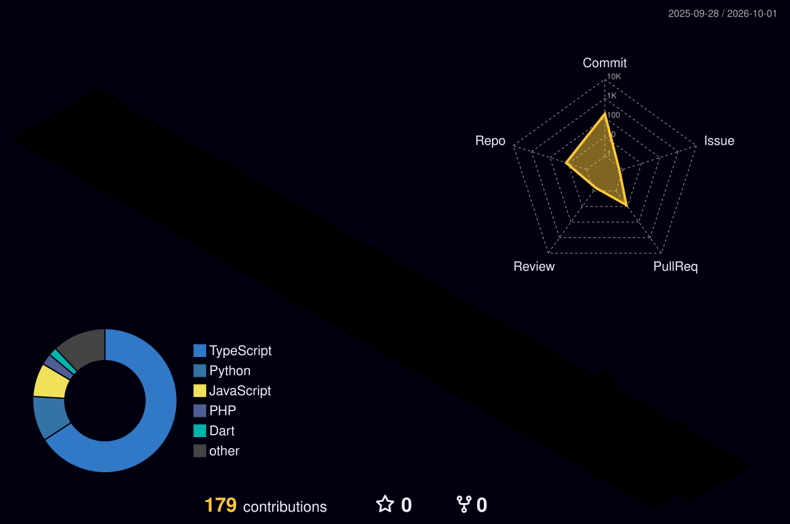

# 👋 Hi, I'm Levin Joeshwa

### 🚀 Software Developer & Digital Marketer

Building modern web applications, AI-powered solutions & digital experiences.

 

  

---

## 👨‍💻 About Me

I'm **Levin Joeshwa**, a Software Developer and Digital Marketer from **Karur, Tamil Nadu, India**.

I enjoy building **modern web applications, backend systems, AI-powered solutions, and digital experiences** that solve real-world problems.

I'm continuously learning new technologies, working on practical projects, and turning ideas into useful digital products.

💻 **Software Development** &nbsp; • &nbsp;
🤖 **AI & Automation** &nbsp; • &nbsp;
🌐 **Web Applications** &nbsp; • &nbsp;
📈 **Digital Marketing**

---

## 🚀 What I Build

<table>
<tr>

<td width="33%" align="center">

### 🌐 Web Applications

Modern, responsive and scalable web applications with clean architecture and great user experience.

</td>

<td width="33%" align="center">

### 🤖 AI-Powered Solutions

Practical AI integrations, automation systems and intelligent tools that solve real-world problems.

</td>

<td width="33%" align="center">

### 📈 Digital Experiences

Websites, digital solutions and marketing-focused experiences that help businesses grow online.

</td>

</tr>
</table>

---

## ⚡ Tech Stack

### 💻 Languages

  

### 🚀 Frameworks & Technologies

  

### 🗄️ Databases & Tools

---

## 🧠 Core Skills

Software Development  
├── Full Stack Web Development  
├── Backend Development  
├── REST API Development  
├── Database Design  
├── Authentication & Authorization  
├── Role-Based Access Control  
└── System Architecture

AI & Automation  
├── AI-Powered Applications  
├── API Integrations  
├── Business Automation  
└── Intelligent Software Solutions

Digital  
├── Digital Marketing  
├── Website Development  
├── Online Presence  
└── Digital Experiences

---

## 💼 Featured Projects

<table>
<tr>

<td width="50%" valign="top">

### 🏦 Finvels Loan Management System

A finance management platform designed to manage members, groups, loans, verification, approvals, repayments, employees and auditing.

**Tech Stack**

`React` `Node.js` `Express` `MongoDB`

</td>

<td width="50%" valign="top">

### 🤖 AI Business Copilot

A business-focused SaaS platform designed to provide AI-powered assistance, automation and intelligent business workflows.

**Tech Stack**

`React` `Laravel` `MySQL` `AI APIs`

</td>

</tr>

<tr>

<td width="50%" valign="top">

### 🎓 Karur Study Centre

A modern educational platform with a React frontend and Laravel-powered backend CMS.

**Tech Stack**

`React` `Laravel` `MySQL`

</td>

<td width="50%" valign="top">

### 🏫 School Management System

A role-based school management platform covering administration, staff, students, attendance and parent-related workflows.

**Tech Stack**

`React` `Laravel` `MySQL`

</td>

</tr>
</table>

---

## 📊 GitHub Analytics

  

---

## 📈 Contribution Activity

---

## 🌌 3D Contribution Universe

---

## 🐍 Contribution Journey

---

## 🎯 Current Focus

🚀 Building production-ready software  
🤖 Exploring AI-powered applications  
🌐 Improving full-stack development skills  
📈 Learning & applying digital marketing  
☁️ Exploring modern cloud technologies  
💡 Turning real-world ideas into digital products

---

## 🌱 Always Learning

  

**Learning → Building → Testing → Improving → Shipping**

---

## 🤝 Let's Connect

  

---

### 💭 "Turning ideas into digital products."

 

